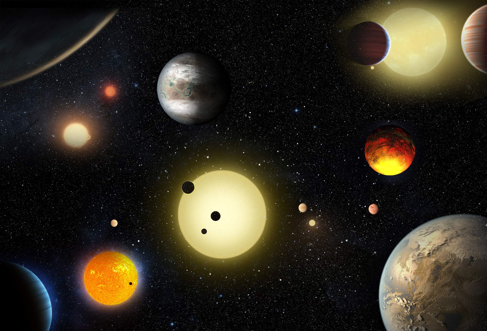

# machine-learning-challenge

The purpose of this assignment was to explore, manipulate, build and then compare multiple machine learning models from the [NASA Kepler Space Telescope](https://www.kaggle.com/nasa/kepler-exoplanet-search-results)
dataset.

This Github Repository contains Jupyter Notebook files for each model and the data wrangling process used to build the algorithm ready dataset.

* [Data Wrangling](https://github.com/TomCallegari/machine-learning-challenge/blob/master/Wrangling.ipynb)
* [Random Forest](https://github.com/TomCallegari/machine-learning-challenge/blob/master/RandomForest.ipynb)
* [Gradient Boosting Machine (GBM)](https://github.com/TomCallegari/machine-learning-challenge/blob/master/GBM.ipynb)
* [Tensorflow.Keras Dense Deep Neural Network](https://github.com/TomCallegari/machine-learning-challenge/blob/master/Deep_NN.ipynb)

## Results Comparison

- GBM: .91 Weighted Average Accuracy
- DNN: .905 Accuracy
- Random Forest: .90 Weighted Average Accuracy

Different versions of data transformations were conducted during the project and run using the 3 chosen algorithms.  Column-wise squared, sin and log transformations were each used to compare model accuracy with a final log then zscore transformation outputting the greatest accuracy. Prior to model ingestion a 0 < x < 1 min-max scaling was also used to ensure variable magnitudes were relative for euclidean based distance measures and to speed gradient descent convergence.

Throughout the modeling and testing process the highest accuracies achieved floated around .90 to .909.  Adding, subtracting, transforming and subsetting the data never provided a breakthrough past these points.  To potentially increase the test accuracy of the models a further, deeper understanding of the domain knowledge providing the data would be necessary. As well, potentially averaging the predictions for each model through an ensemble method or algorithm might bear better results.

### Python Packages Used

* Sklearn
* Tensorflow.Keras
* Numpy
* Pandas
* Matplotlib
* Seaborn
* Scipy
* Joblib

### Load Model
```
from joblib import load

GBM = load('GBM.joblib')

```